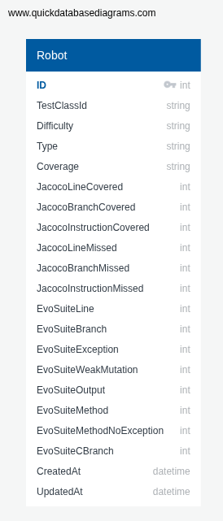
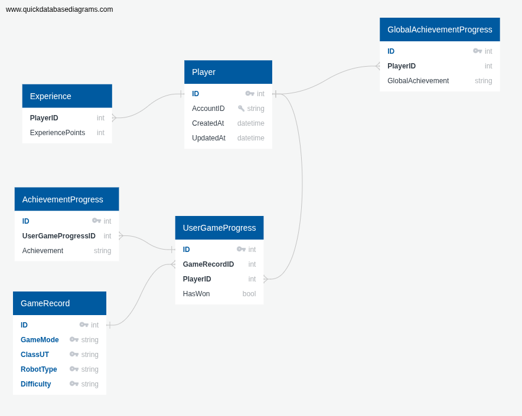
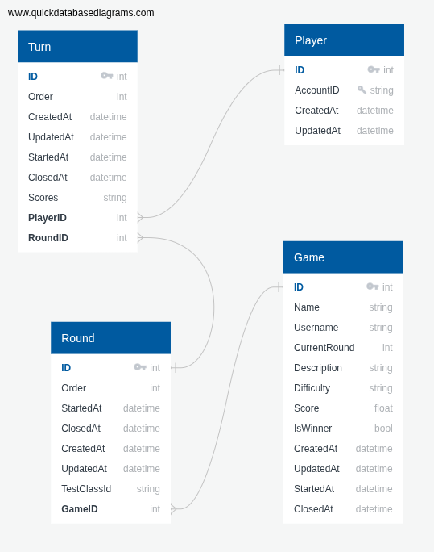

# T4 Service - Game Repository
Il servizio T4 si occupa di tracciare e mantenere tutte le informazioni riguardanti le partite e lo stato del giocatore, quali:
- Le partite giocate, con relative vittorie e sconfitte;
- I robot (avversari) disponibili per ogni classe di test;
- I punti esperienza ottenuti, gli achievement sbloccati e i robot battuti.

---

## Robots data model and Rest endpoints
I robot (avversari) disponibili per le varie classi da testare sono descritti attraverso l'entità **Robots**.

### Robot - `/robots`

| HTTP Method | Endpoint                          | Function                                                        |
|-------------|-----------------------------------|-----------------------------------------------------------------|
| GET         | `/robots/`                        | Restituisce i robot disponibili con tutte le loro informazioni. |
| GET         | `/robots/all`                     | Restituisce i robot disponibili.                                |
| GET         | `/robots/evosuitecoverage`        | Restituisce le metriche evosuite associate al robot indicato.   |
| POST        | `/robots/`                        | Aggiunge uno o più nuovi robot.                                 |
| DELETE      | `/robots/`                        | Rimuove uno o più robot                                         |

---

## Player status data model and Rest endpoints
Lo stato dell'utente come giocatore è descritto attraverso le seguenti entità:
- **Experience**: traccia i punti esperienza accumulati dall'utente;
- **GlobalAchievementProgress**: traccia gli achievement non legati alle modalità di gioco sbloccati dal giocatore. Un giocatore può essere associato a 0, 1 o multipli GlobalAchievementProgress, dove ognuno di questi rappresenta un achievement sbloccato dal giocatore;
- **UserGameProgress**: traccia gli avversari, intesi come coppia robot-modalità di gioco, affrontati dal giocatore, indicando se sono stati battuti o meno;
- **AchievementProgress**: traccia gli achievement sbloccati dal giocatore legati a un certo avversario.  Un giocatore può essere associato a 0, 1 o multipli AchievementProgress, dove ognuno di questi rappresenta un achievement sbloccato.

###  Avversari sconfitti e Achievement - `/progress`

| HTTP Method | Endpoint                                                                 | Function                                                                                                                                                                                           |
|-------------|--------------------------------------------------------------------------|----------------------------------------------------------------------------------------------------------------------------------------------------------------------------------------------------|
| GET         | `/progress/{playerId}/{gameMode}/{classUT}/{robotType}/{difficulty}`     | Restituisce lo stato del giocatore rispetto a un avversario (identificato dalla modalità di gioco e dal robot scelto), ovvero gi achievement sbloccati e se è già stato battuto in passato o meno. |
| POST        | `/progress/`                                                              | Crea un nuovo stato (vuoto - nessun achievement e avversario non ancora battuto) per il giocatore rispetto a un avversario.                                                                        |
| PUT         | `/progress/state/{playerId}/{gameMode}/{classUT}/{robotType}/{difficulty}` | Aggiorna lo stato del giocatore rispetto all'avversario per indicare che quest'ultimo è stato battuto.                                                                                             |
| PUT         | `/progress/achievements/{playerId}/{gameMode}/{classUT}/{robotType}/{difficulty}` | Aggiorna lo stato del giocatore rispetto all'veersario con i nuovi achievement sbloccati.                                                                                                          |
| GET         | `/progress/{playerId}`                                                   | Restituisce lo stato del giocatore per ovvi avversario che ha affrontato.                                                                                                                          |
| GET         | `/progress/global-achievements/{playerId}`                               | Restituisce gli achievement sbloccati dal giocatore che non sono legati agli avversari.                                                                                                            |
| PUT         | `/progress/global-achievements/{playerId}`                               | Aggiorna gli achievement del giocatore non legati agli avversari.                                                                                                                                  |

### Punti Esperienza Utente - `/experience`

| HTTP Method | Endpoint              | Function                                                                                              |
|-------------|-----------------------|-------------------------------------------------------------------------------------------------------|
| GET         | `/experience/{playerId}` | Restituisce l'esperienza accumulata da un giocatore dato il suo `playerId`.                           |
| POST        | `/experience/`        | Inizializza (a 0) l'esperienza di un nuovo giocatore appena registrato.                               |
| PUT         | `/experience/{playerId}` | Incrementa l'esperienza del giocatore identificato da `playerId` del valore passato nel request body. |

---

## Games data model and Rest endpoints

Le partite vengono gestite tramite le seguenti entità:
- **Game**: descrive una partita in corso o conclusa per un certo giocatore;
- **Round**: descrive un round all'interno della partita;
- **Turn**: descrive un turno all'interno di un round di una partita;

### Partite - `/games`

| HTTP Method | Endpoint          | Function                                                     |
|-------------|-------------------|--------------------------------------------------------------|
| GET         | `/games/{id}`     | Restituisce le informazioni di una partita dato il suo `id`. |
| GET         | `/games/player/{pid}` | Restituisce tutte le partite associate al giocatore `pid`.   |
| GET         | `/games/`         | Restituisce tutte le partite salvate nel sistema.            |
| POST        | `/games/`         | Crea una nuova partita.                                      |
| PUT         | `/games/{id}`     | Aggiorna lo stato della partita `id` in corse.               |
| DELETE      | `/games/{id}`     | Rimuove la partita `id`.                                     |

### Round di gioco di una partita - `/rounds`

| HTTP Method | Endpoint          | Function                                    |
|-------------|-------------------|---------------------------------------------|
| GET         | `/rounds/{id}`    | Restituisce le informazione del round `id`. |
| GET         | `/rounds/`        | Restituisce tutti i round salvati.          |
| POST        | `/rounds/`        | Crea un nuovo round.                        |
| PUT         | `/rounds/{id}`    | Aggiorna un round esistente.                |
| DELETE      | `/rounds/{id}`    | Rimuove un round esistente.                 |

### Turni all'interno dei Round - `/turns`

| HTTP Method | Endpoint              | Function                                                  |
|-------------|-----------------------|-----------------------------------------------------------|
| GET         | `/turns/{id}`         | Restituisce un turno dato il suo `id`                     |
| GET         | `/turns/`             | Restituisce tutti i turni associati al Round specificato. |
| POST        | `/turns/`             | Crea un nuovo turno associandolo ad un Round.             |
| PUT         | `/turns/{id}`         | Aggiorna lo stato di un turno dato il suo `id`.           |
| DELETE      | `/turns/{id}`         | Rimuove un turno dato il suo `id`.                        |
| GET         | `/turns/{id}/files`   | Deprecato.                                                |
| PUT         | `/turns/{id}/files`   | Deprecato.                                                |

---

